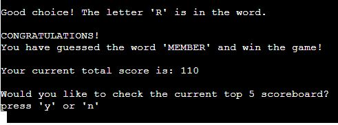
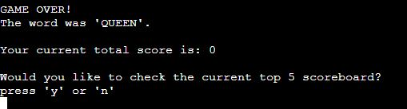
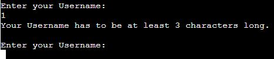

# Hangman 3000

## Introduction
This is a Hangman game where you can guess the hidden word and get scores depending on your performance. It's made to be attractive for the user and provide some fun for both first time players and veterans. 

[View the live project here](https://hangman-3000.herokuapp.com/)

[Link to Github Repository](https://github.com/BjornRodin/hangman)

## Table of Content
- [Introduction](#introduction)
- [User Experience (UX)](#user-experience-ux)
    - [User Stories](#user-stories)
        - [First Time Visitor Goals](#first-time-visitor-goals)
        - [Returning Visitor Goals](#returning-visitor-goals)
        - [Administrators](#administrators)
    - [Design](#design)
        - [Graphics](#graphics)
        - [Flowchart](#flowchart)
- [Features](#features)
    - [Existing Features](#existing-features)
    - [Future Features](#future-features)
- [Testing](#testing)
    - [User Stories Testing](#user-stories-testing)
       - [As a first time visitor I want to quickly find and understand the rules](#as-a-first-time-visitor-i-want-to-quickly-find-and-understand-the-rules)
       - [As a first time visitor I want to know how to start the game](#as-a-first-time-visitor-i-want-to-know-how-to-start-the-game)
       - [As a first time visitor I want to get feedback along the way of the game](#as-a-first-time-visitor-i-want-to-get-feedback-along-the-way-of-the-game)
       - [As a returning visitor I want to see the top scores so I can try to beat it](#as-a-returning-visitor-i-want-to-see-the-top-scores-so-i-can-try-to-beat-it)
       - [As a returning visitor I want to be able to quickly restart the game when it's over](#as-a-returning-visitor-i-want-to-be-able-to-quickly-restart-the-game-when-its-over)
       - [As a returning visitor I want to have a calm background and game with pleasing design](#as-a-returning-visitor-i-want-to-have-a-calm-background-and-game-with-pleasing-design)
       - [As a administrator I want to provide the users with a game that is easy to navigate](#as-a-administrator-i-want-to-provide-the-users-with-a-game-that-is-easy-to-navigate)
       - [As a administrator I want to provide simple functions to not overcomplicate things](#as-a-administrator-i-want-to-provide-simple-functions-to-not-overcomplicate-things)
       - [As a administrator I want to provide a design and feedback that is fun and engages with the user](#as-a-administrator-i-want-to-provide-a-design-and-feedback-that-is-fun-and-engages-with-the-user)
    - [Automated Testing](#automated-testing)
        - [W3C Markup Validation Service](#w3c-markup-validation-service)
        - [W3C CSS Validation Service](#w3c-css-validation-service)
        - [JSHint Javascript Validator](#jshint-javascript-validator)
        - [Google Lighthouse Performance Test](#google-lighthouse-performance-test)
        - [Python Validator](#python-validator)
        - [Warnings](#warnings)
    - [Manual Testing](#manual-testing)
        - [Features Test](#features-test)
        - [Responsiveness](#responsiveness)
- [Bugs](#bugs)
- [Technologies](#technologies)
- [Deployment](#deployment)
    - [Deployment to Heroku](#deployment-to-heroku)
    - [Version Control](#version-control)
- [Credits](#credits)
    - [Media](#media)
    - [Code](#code)
- [Acknowledgements](#acknowledgements)

## User Experience (UX)

### Introduction
The goal for this website is to provide people with a fun game to spend some time but not having to invest hours upon hours of gametime. Play the game wherever you are and whenever you feel like it. The hidden words is chosen from a list of 450+ unique nouns and within each game the same word can't be chosen twice. The difficulty is random, due to the length of the words, but thanks to a adaptive scoring system you will get more points if the word is harder.
In the end of the game you can either chose to play again and guess another word (and further increase your score) or to end the game. Whenever the game is ended you will be updated if you are in the top 5 or not and then the scoreboard is printed.
Enjoy!

### User Stories

#### First Time Visitor Goals
As a first time visitor I want to:
- quickly find and understand the rules.
- know how to start the game.
- get feedback along the way of the game.

#### Returning Visitor Goals
As a returning visitor I want to:
- be able to quickly restart the game when it's over.
- see the top scores so I can try to beat it.
- have a calm background and game with pleasing design.

#### Administrators
As a administrator I want to:
- provide the users with a game that is easy to navigate.
- provide simple functions to not overcomplicate things.
- provide a design and feedback that is fun and engages with the user.

### Design

#### Graphics
The graphics of the hangman was designed from how I used to play the game as a kid when doing it on a whiteboard at school. By using "/", "\", "0" & "|" I could replicate a simple, but useful, graphic that updates over time in the game.

#### Flowchart
To create the general idea of how the game logically should be running I made a simple flowchart with [Lucidchart](https://www.lucidchart.com). By doing this I had something to lean back on when programming so I had something to guide me. I was almost certain that it was not going to be made exactly as I made the chart, as I have never done one before, but I am happy with the result. It's pretty close to the end product as well so it definitely was a good thing to spend time on. If anything I would probably spend more time on that in the future for other projects, but due to some time-constraints on my end this time I couldn't spend more time on it. 

## Features

### Existing Features
- When the game is started the user is presented with a hangman graphic, most likely they will recognize it immediately and know the game even without the rules. But, to make it informative, rules are printed aswell so the user know what to expect.
    
    
- On the bottom of the page the user is asked to enter their username.

    
- When username is accepted it is printed with a "Hello" message and asking the user to press "Enter" when ready to start the game.

    
- After starting the game the below image is presented to the user, slightly different depending on the length of the word. The user can then see how many letters the word has, a graphic, underscores representing each letter in the hidden word, letters previously guessed, number of guesses remaining and then a prompt for the user to input a guess in the form of a letter.

    
- If the user make a wrong guess it prompts the same message but updated with the letter that was guessed and that the letter that was guesses is wrong, see image below where several wrong guesses has been made.

    
- When the user make a correct guess the game still prompts the same message but of course updated with the new information, for example mentioning that the guess was correct.

    
- If the game is won the user is presented with that their last letter was correct, a congratulation message containing what the word was, the total score and the question if they want to view the current scoreboard. After this the user get asked if they want to continue playing or not.
If the user continue playing and guess the next word aswell the score from that will be added to this total score shown in the image below. If "y" is chosen the game start over again from where the user has to click "Enter" to start the game.

    
- If all the guesses is used and the word is not guessed yet, the game is lost and awards no points. If they guessed another word previously, but correctly, that score will still be kept. But if the word is not guessed then this will be printed to the game. The user still get the same question if they want see the scoreboard and then if they want to play again or not.

    
- When the user doesn't want to play anymore they can instead chose to stop the game when they are asked if they want to continue or not. If they stop, the game will print a thank-you message, the final score, trying to update the scoreboard, if the score is not in the top 5 a sorry message is printed, if it is in the top 5 though then a congratulation message is printed instead, in the end the scoreboard will be printed either way to show the top 5 scores. See the two below images.

    

    

### Future Features
- More custom messages randomly chosen to make it feel more "alive" and fun.
- Importing or finding another way to choose random words, right now a spreadsheet is used where i've generated 450+ random words, would make sense to have thousands to make sure the game can be long-lived.
- Right now within a single game (where you chose to play again over and over again) the game can't choose the same word twice. But when the game is rerun that is refreshed, so all words is available again. To stop this, a future development could be that a user can access their previous game so that they could continue until all words are used and they will never be able to encounter the same word twice.
- Colors could be used to emphasize certain elements to even better indicate when something "good" or something "bad" happens.
- In the scoreboard there could also be a date-stamp to show when each top 5 score was made, this would indicate to a user how active people are in the game.
- When not guessing a word correctly the users score could be decreased, to penalize it even further.
- Add a way of choosing difficulty, in this type of game shorter words are harder to guess than longer ones. In the current game this is randomized instead so the user can get both very short words and very long ones. To handle this in my game I made it so the score gained is higher for shorter words than for longer ones. But being able to choose "Easy", "Moderate", "Hard" or "Randomize" could be nice in the future.

## Testing

### User Stories Testing

#### As a first time visitor I want to quickly find and understand the rules
- As soon as the game is loaded the user can easily see the rules printed on the screen.

    

#### As a first time visitor I want to know how to start the game
- As soon as the game is loaded the cursor is set to the bottom of the page, asking for the users username. As this is the only thing the user can interact with it is logical for the user to start there.

    
- When username is entered and accepted the user is presented with a message saying "press Enter to start the game...".

    
- When the user lost all their guesses or guessed the word correctly the game prompts the user with a choice if they want to view the current scoreboard or not, not matter if the user chose "y" or "n" the user is directly after this asked if they want to play again or not.

    

#### As a first time visitor I want to get feedback along the way of the game
- Every time the user enters some input, that input is validated in the code, if not valid the user is presented with what they have to do. For example:

    
- When guessing wrong or correct letter the user get printed messages showing what their input was and if it was wrong/correct.

    
- When the input has been checked for wrong/correct then the corresponding graphics is updated accordingly.

    
- This continues all the way until remaining guesses is "0" or the word is guessed correctly, depending on which, the feedback changes.

    

    

#### As a returning visitor I want to see the top scores so I can try to beat it
- When the game is over and the user chooses to stop playing, the game check if the score that is accumulated is in the top 5 scores overall. If it is their result is added to the board. It doesn't matter if the user is in the top 5 or not, when this is checked the scoreboard is printed.

    

#### As a returning visitor I want to be able to quickly restart the game when it's over
- As mentioned earlier, when there is no more guesses or the word is guessed correctly the game prompts the user with a choice to play again or to stop.

#### As a returning visitor I want to have a calm background and game with pleasing design
- As there is not much design specifically in the game, that is not the primary goal of this project.
- The game is kept simple and logical, some graphics is added to make it more fun to look at and it also works as feedback for the user.
- However, the background is black, text is white, so the contrast between those two is very good and hence make it calmer for the eyes.

#### As a administrator I want to provide the users with a game that is easy to navigate
- As the game is run in a command-window the navigation is very simple. Any inputs asked for is always entered at the bottom of the page and the cursor is always automatically moved along.
- The messages for what information to input is simple and if something is wrong a message to correct the misstake is printed so the user can correct their input. Some examples below:

    

    

#### As a administrator I want to provide simple functions to not overcomplicate things
- It is very simple as the user can't deviate from the premade path of the game.

#### As a administrator I want to provide a design and feedback that is fun and engages with the user
- Regarding the design I've done what I could to make it as pleasing as possible aswell as provide utility to the user.
- The hangman graphics is updated depending on how many guesses there is left which make the game way more fun than if it was not present.
- Having the scoreboard printed in the end of the game is probably one of the most important parts to make a user want to play again to either beat their own score or someone elses.

### Automated Testing

#### W3C Markup Validation Service
In this project all i've been involved in doing is everything regarding Python, that mean i've been involved in the following: "creds.json", "run.py" "requirements.txt", "README.md" and "documentation". Everything else, HTML, CSS, JS etc. was given from the course i'm attending from [Code Institute](https://codeinstitute.net/se/). That means I won't be testing those.

#### W3C CSS Validation Service
In this project all i've been involved in doing is everything regarding Python, that mean i've been involved in the following: "creds.json", "run.py" "requirements.txt", "README.md" and "documentation". Everything else, HTML, CSS, JS etc. was given from the course i'm attending from [Code Institute](https://codeinstitute.net/se/). That means I won't be testing those.

#### JSHint Javascript Validator
In this project all i've been involved in doing is everything regarding Python, that mean i've been involved in the following: "creds.json", "run.py" "requirements.txt", "README.md" and "documentation". Everything else, HTML, CSS, JS etc. was given from the course i'm attending from [Code Institute](https://codeinstitute.net/se/). That means I won't be testing those.

#### Google Lighthouse Performance Test
The tests are all made in the same way:
1. In incognito-mode
2. The same configuration is used, showed in below image. Only 'Device' was changed in between the tests.
    
    

- Desktop

    
- Mobile

    

#### Python Validator
To test the python code the [CI Python Linter](https://pep8ci.herokuapp.com/#) was used. To do it I copied all code from GitPod and printed it to the validator. I forgot to printscreen the first result but after handling all the things it mentioned the code is now all clear and validated.
Most things that it raised as issues was: to few spaces between functions, some whitespaces that had to be removed and code being to wide. I made the changes inside the validator first as it was updating live whenever I made a change so it was a really handy tool to use!

#### Warnings
No present warnings anywhere else.

### Manual Testing
Tested according to below image and passing everything.

#### Responsiveness
I can't really test the responsiveness as "it is what it is", but I still put it into the Am I Responsive website just to get some images for it. However, the game works both on desktop and on mobiles.

[Am I Responsive?](https://ui.dev/amiresponsive?url=https://hangman-3000.herokuapp.com/)

## Bugs
1. Encountered a "bug" where it could be possible for the random word to be an empty cell if any of those were to be present in the spreadsheet.
    - It was resolved with a while loop to make sure the word can't be "0" characters long, meaning it has to have some kind of content.
2. I had issues with replacing underscores in the word_hidden variable in the beginning due to making it into a "string". 
    - After discussing this with my mentor he asked me to check out to make it into a "list" instead because those are easier to change. So that is what I did and it solved the issue so the variable updates correctly and present the user with the correct output.
3. While implementing the scoreboard there was some issues with both checking the values in the spreadsheet correctly, updating them and then printing them in the correct order.
    - I found much to use from this post [stackoverflow](https://stackoverflow.com/questions/8966538/syntax-behind-sortedkey-lambda) to aid me in how to sort values and so forth. After much testing I realized I was sorting the values incorrectly which inherently made functions related to it not work as expected. Now it only appends the username and score if there is either less than 5 values in the spreadsheet or if the score is in the top 5. This also make sure that the spreadsheet won't be totally filled with data as not all finished games will be appended.
4. When first starting out, many of the functionalities was implemented in the same function, playgame, I quickly realized that won't work. But I wanted to have more functionality before starting to refactoring the code. When that process started there was a few "bugs" due to code not being called correctly or put in the wrong places. 
    - To fix this it was much "trial by error" but also much reading the code over and over again asking myself what I was really asking it to do so I could better understand why things wasn't working as expected. 
    - The terminal in Gitpod also provided with clues, of course, what was wrong so that was used alot.
    - More than that, general google searches and looking in stackoverflow aided me aswell as the walkthrough project love-sandwiches and the python essentials from Code Institute.

## Technologies
- [Code Institute Template](https://github.com/Code-Institute-Org/python-essentials-template) was used during this project.
- [GitHub](https://github.com/) is the host which is used to store the code.
- [Git](https://git-scm.com/) was used to commit and push the code to the GitHub repository and works as a version control software. 
- [Lucidchart](https://www.lucidchart.com) was used to create the flowchart.
- [Google Chrome Lighthouse](https://developers.google.com/web/tools/lighthouse) was used when testing the site.
- [W3C School](https://www.w3schools.com/) was used to aid in coding.
- [Am I Responsive](https://ui.dev/amiresponsive?url=https://hangman-3000.herokuapp.com/) was used to give the reader a quick and easy way to see the responsiveness of the site and also to have a image for the introduction of the Readme.md.
- [RandomWordGenerator](https://randomwordgenerator.com/noun.php) was used to generate words (nouns) to use in the spreadsheet.
- [Reddit](https://www.reddit.com/r/dataisbeautiful/comments/9b036p/the_number_of_wrong_guesses_needed_to_win_at/) was used to get information about how hard it is to guess different lengths of words.
- [CI Python Linter](https://pep8ci.herokuapp.com/#) was used to validate the Python-code.
- [Google Sheets](https://www.google.com/sheets/about/) was used to create the spreadsheet used in the project.
- [Google Sheet API](https://developers.google.com/sheets/api/guides/concepts) used to connect the project with the spreadsheet so it can be accessed.
- [Heroku](www.heroku.com) project is deployed to Heroku to make it into an app that is accessible through a browser.

## Deployment 

### Deployment to Heroku
1. Enter "requirements.txt" file within Gitpod.
    - In the terminal, type 'pip3 freeze > requirements.txt'.
        - After discussing it with my mentor I removed everything except 'google-auth==2.17.3' and 'gspread==5.8.0' because nothing else is used within my code.
    - Add the changes with the command 'git add .'.
    - Commit them with command 'git commit -m""'.
    - Then push them to github with 'git push'.
2. Assuming you have a Heroku account, otherwise you have to create one.
3. In Heroku, click "Create a new app".
    - Give the app a valid name (names are unique).
    - Then choose your region.
    - Lastly click "Create app"
4. In the tabs, click "Settings".
5. Scroll down to "Config Vars", click "Reveal Config Vars".
    - In the field "KEY", type "CREDS".
        - Return to your "creds.json" file in Gitpod, copy all the code.
        - Paste the copied code in the field "VALUE" in Heroku.
        - Then click "Add"
    - Add another "Config Var".
        - In the field "KEY", type "PORT".
        - In the field "VALUE", type "8000".
        - Then click "Add"
6. Scroll down to "Buildpacks", click "Add buildpack".
    - Choose "python" from the popup, click "Save changes".
    - Click "Add buildpack" again.
    - Choose "nodejs" from the popup, click "Save changes".
    - Make sure that "python" is first in the list you will see. If it isn't, left-click and drag it so "python" come before "nodejs".
7. Scroll up and from the menu-tab, click "Deploy".
    - In "Deployment method", choose "GitHub" by clicking it.
    - In "Connect to GitHub", click "Connect to GitHub".
    - In "Connect to GitHub" there now is a searchbar, enter your repository name and then click "Search".
    - Your repository should appear, click "Connect" next to it.
8. Scroll down so you can see "Automatic deploys" and "Manual deploy".
    - You can choose either option.

You have now deployed your project to Heroku!

### Version Control
- A repository was made on Github with Code Institutes Template.
- Coding for the site was done on the [Gitpod](https://www.gitpod.io/) platform.
- Code was added to the staging area with the 'git add .' command.
- The changes in the staging area was committed with the 'git commit -m " "' command.
- All committed code was pushed to Github repository with the 'git push' command.

## Credits
### Media
No media used.

### Code
- The code that was used in the project was mostly learnt via [Code Institute](https://codeinstitute.net/se/) and their Full Stack Software Development course.
- [W3 School](https://www.w3schools.com/) was mostly used to solve issues or alternate ways to do the coding.
- StackOverflow was used to search for information, for example I read this alot [stackoverflow](https://stackoverflow.com/questions/8966538/syntax-behind-sortedkey-lambda) to help me understand how to sort with lambda etc.

### Content
- The content was designed and written by me.

## Acknowledgements
- Thank you to my family, especially Joakim Rödin, who have supported, pushed and encouraged me during the project.
- Gratitude to my mentor Jack Wachira for the support he has given me.
- The Slack community.